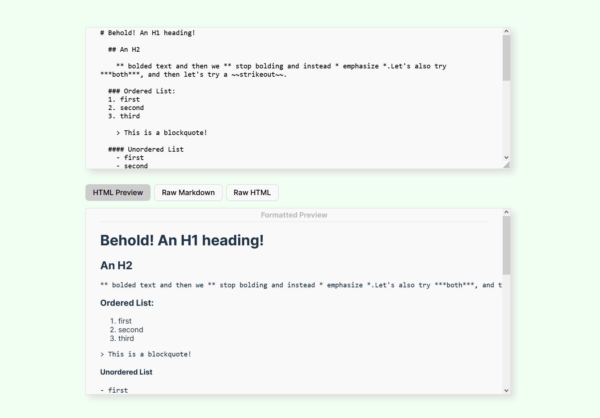

# React Live Markdown Editor Comparison
<div align="center">
  
</div>

--- 

### 📖 Description
This is a very basic component that implements a live "What you see is what you get" (WYSIWYG) Markdown editor in React using several JavaScript Markdown editor libraries, with the ability to switch between libraries with the press of a button. The libraries currently available to switch between are:
* [ProseMirror](https://prosemirror.net/) 
* [tiptap.js](https://tiptap.dev/docs) with [marked.js](https://marked.js.org/)
* [markdown-it](https://github.com/markdown-it/markdown-it#readme)

The point of this component is to create an editor that I can use to author blog posts in-browser, and during the process of writing I want to be able to more or less know what the blog post will look like when it is displayed to a user before sending the raw markdown text to the backend. During a page visit, the backend will send the raw markdown for a specific blog post upon request, and display it for website visitors in roughly the same way it is displayed in this WYSIWYG Editor.

I am trying out various libraries for this task so I may have other repos with similar WYSIWYG Markdown React editor components available on my Github profile created with different libraries, depending on when you are reading this.    
<br><br/> 

### 🛠 Technologies Used

* _React_
* _JavaScript_
* _HTML_
* _sass_
* _eslint_
* _ProseMirror_ \([docs](https://prosemirror.net/docs/)\)
* _tiptap.js_ \([docs](https://tiptap.dev/docs)\)
* _marked.js_ \([docs](https://marked.js.org/)\)
* _markdown-it_ \([repo/docs](https://github.com/markdown-it/markdown-it#readme)\)
* _npm_
<br><br/>

### 🦠 Known Bugs, Issues, or Comments

1. Default styling is basic to ensure easier portability. For instance the the default selected button is not highlighted on page load
2. Default styling is made for desktop viewing rather than mobile
3. Default styling uses `.scss` (sass) files rather than `.css`, but no sass-specific syntax or features (mixins, etc) are used, so it should work fine to rename the stylesheets with a `.css` filename if you don't want to install sass
3. State is not output to anywhere (no back-end or local storage used), because state use is highly dependent upon specific implementation details and the goal is only to see how each library's UI behaves as well as how simple the code and its dependencies are
4. Input needs to be sanitized!
5. ProseMirror has issues with Raw HTML View, some styling (strikeouts, etc), and URL links
6. Need to add more libraries (Quill? Slate? Others?)
7. Designed for large screens! This type of functionality is not as useful on small screens, so I haven't bothered with responsive styling for mobile yet. 

<br><br/>

### 🔧 Setup/Installation

##### Installing this entire repo
* _clone git repository to a local machine_
* _navigate to root folder of the project using command line_
* _use the '$ npm install' command to install necessary packages_
* _type in '$ npm run build' to build project_
* _type in '$ npm run dev' command to open project in browser and start live server_
* _have a great time all the time_

##### Copying component to an existing React Project
* _copy `src/components/LiveMarkdownEditor/` folder into your Project wherever React components are placed_
* _install dependencies listed in package.json (npm example: `npm install markdown-it`)_
* _install sass if you want to use `.scss` files (`npm install sass`) OR change `.scss` filenames to have `.css` extensions_
* _i've included default demonstration text that displays on app load. If you do not want this text, go inside each of the [LibraryName]Editor.jsx files that represent the main code for each library, delete the import and the useState references to the demo text files (demoText-TipTap.js for example). _
* _modify styling and React elements as necessary to fit your project_
* _have an excellent rest of your day_


## ⚖️ License

[LINK](https://opensource.org/licenses/MIT)    

```
MIT License
Permission is hereby granted, free of charge, to any person obtaining a copy
of this software and associated documentation files (the "Software"), to deal
in the Software without restriction, including without limitation the rights
to use, copy, modify, merge, publish, distribute, sublicense, and/or sell
copies of the Software, and to permit persons to whom the Software is
furnished to do so, subject to the following conditions:
The above copyright notice and this permission notice shall be included in all
copies or substantial portions of the Software.
THE SOFTWARE IS PROVIDED "AS IS", WITHOUT WARRANTY OF ANY KIND, EXPRESS OR
IMPLIED, INCLUDING BUT NOT LIMITED TO THE WARRANTIES OF MERCHANTABILITY,
FITNESS FOR A PARTICULAR PURPOSE AND NONINFRINGEMENT. IN NO EVENT SHALL THE
AUTHORS OR COPYRIGHT HOLDERS BE LIABLE FOR ANY CLAIM, DAMAGES OR OTHER
LIABILITY, WHETHER IN AN ACTION OF CONTRACT, TORT OR OTHERWISE, ARISING FROM,
OUT OF OR IN CONNECTION WITH THE SOFTWARE OR THE USE OR OTHER DEALINGS IN THE
SOFTWARE.
```
If you have any issues, questions, or canned fish recommendations, send me a message!    
Copyright (c) _2024_  _Eric Crudup_

<center><a href="#">Return to Top</a></center>
